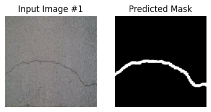
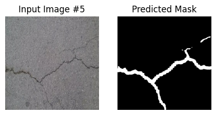

# 🔍 Crack Segmentation

Automatic crack detection and segmentation in concrete surface images using a deep learning model built with TensorFlow/Keras. The model outputs a pixel-level mask showing the exact shape and location of cracks.

---

## Examples

---

## Results

| Metric | Score |
|--------|-------|
| Dice Coefficient | 0.6643 |

---

## Model

- **Framework:** TensorFlow / Keras
- **Task:** Binary semantic segmentation
- **Input:** RGB concrete surface images
- **Output:** Binary crack mask (crack / no crack per pixel)

---

## Dataset

The model was trained on a crack segmentation dataset containing images of concrete surfaces labeled with pixel-wise crack masks.
Url - https://www.kaggle.com/datasets/lakshaymiddha/crack-segmentation-dataset